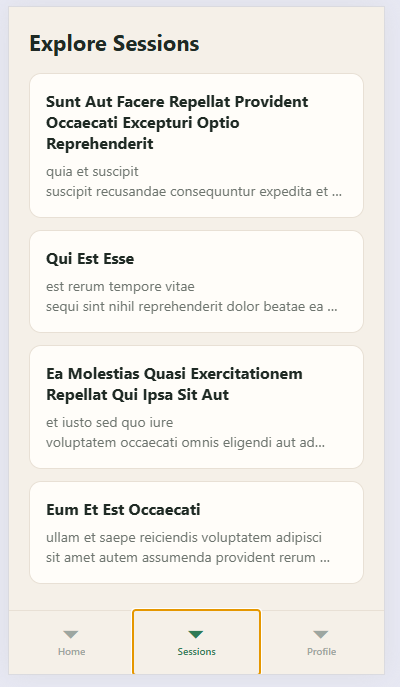
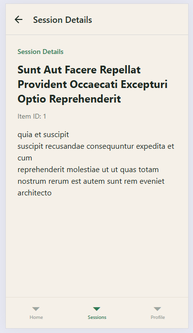
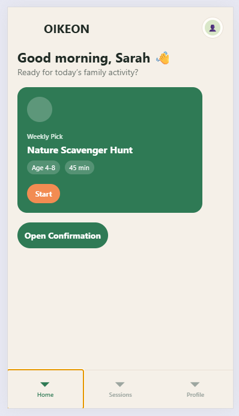

# OIKEON — Cross Assignment 5

## Project Overview

OIKEON is a family-centered mobile learning application.  
In this assignment, API integration was added to the existing React Native project.

The goal was to fetch remote data, store it in component state, display it in a list, handle loading and error states, and integrate the data flow with navigation.

---

## API Choice

For this project, a public REST API was used:

`https://jsonplaceholder.typicode.com/posts`

Because the app theme does not have a direct public API for OIKEON content, JSONPlaceholder was used as a reliable mock API source.  
The fetched posts were treated as learning sessions / activities.

---

## Features Implemented

- GET request to public REST API
- API logic moved to a separate file (`api.js`)
- State management with `useState`
- Data loading with `useEffect`
- `FlatList` for rendering session items
- Custom reusable card component for list items
- Loading indicator with `ActivityIndicator`
- Error handling with user-friendly message
- Navigation to details screen with parameter passing

---

## Project Structure

```bash
src
├── api
│   └── api.js
├── components
│   └── SessionListCard.jsx
├── navigation
│   ├── AppNavigator.js
│   ├── HomeStack.js
│   ├── SessionsStack.js
│   └── TabsNavigator.js
├── screens
│   ├── ConfirmationScreen.jsx
│   ├── HomeScreen.jsx
│   ├── ProfileScreen.jsx
│   ├── SessionDetailsScreen.jsx
│   └── SessionsScreen.jsx
```

---

## API Logic

The request logic is isolated in:

`src/api/api.js`

This improves modularity and keeps screen components cleaner.

---

## Navigation Integration

The fetched data is displayed inside `SessionsScreen`, and each item supports navigation to `SessionDetailsScreen`.

When a user taps a session card, the following parameters are passed:

- `itemId`
- `title`
- `body`

These values are received via `route.params` and rendered on the details screen.

---

## Loading and Error Handling

The project includes:

- loading state with `ActivityIndicator`
- error state with descriptive fallback text
- safe handling of route parameters in the details screen

---

## Screenshots

### Sessions List



### Session Details



### Home Screen



---

## How to Run

```bash
npm install
npx expo start -c
```

Then:

- press `w` to open in browser
- or scan the QR code with Expo Go

---

## Technologies Used

- React Native
- Expo
- Axios
- React Navigation
- Expo Router
- FlatList
- ActivityIndicator

---

## Assignment Requirements Covered

- public REST API integrated
- GET request implemented with Axios
- API logic moved to separate file
- data stored in component state
- items displayed with FlatList
- loading and error states added
- navigation integrated with details screen
- parameters passed between screens
- screenshots added to README
