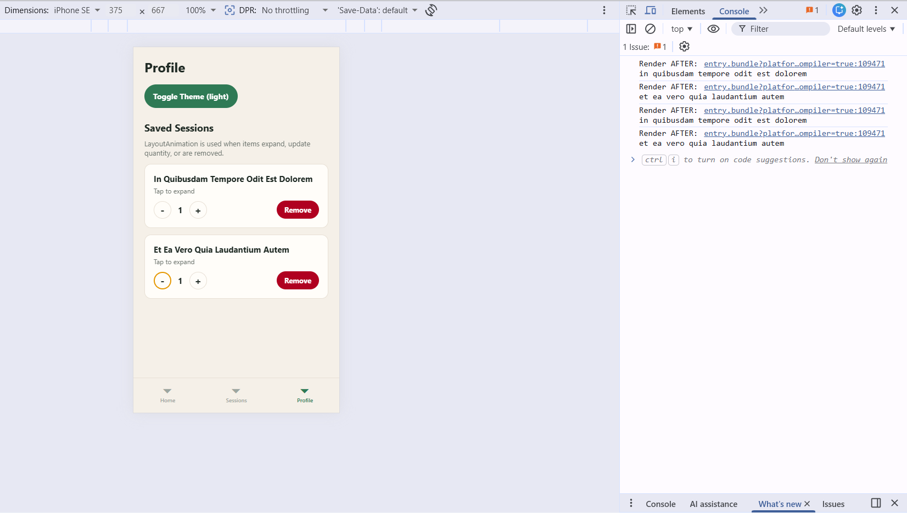

# OIKEON — Cross Assignment 7

## Project Overview

OIKEON is a family-centered mobile learning application built with React Native and Expo.

This assignment focuses on animation, render optimization, and dependency cleanup / bundle optimization.

---

## Task 1: Project Analysis

### Component selected for animation

The **Saved Sessions** list in `ProfileScreen` was selected for animation.

Why:

- saved sessions can expand / collapse;
- quantity can be updated;
- items can be removed;
- all of these actions change the layout and are suitable for layout animation.

### Component selected for render optimization

The **SessionListCard** component inside `FlatList` was selected for render optimization.

Why:

- it is rendered many times in a list;
- it receives callback props;
- unnecessary rerenders can happen when parent state changes.

### Dependency cleanup / bundle optimization

A lightweight date utility was used:

- `dayjs`

The project avoids heavier date libraries such as `moment`.  
`dayjs` is used for simple date formatting in the list and details screen.

---

## Task 2: Animation

Animation was implemented with **LayoutAnimation**.

Location:

- `src/screens/ProfileScreen.jsx`
- `src/components/SavedSessionItem.jsx`

Animated interactions:

- expand / collapse saved session item;
- increase quantity;
- decrease quantity;
- remove saved session.

For Android, layout animation support is enabled with:

```javascript
UIManager.setLayoutAnimationEnabledExperimental?.(true);
```

---

## Task 3: Render Optimization

The following optimizations were implemented:

### React.memo

Used in:

- `SessionListCard.jsx`
- `SavedSessionItem.jsx`

This prevents unnecessary rerenders when props do not change.

### useCallback

Used in:

- `SessionsScreen.jsx`
- `ProfileScreen.jsx`

This keeps callback props stable between renders.

### useMemo

Used in:

- `SessionsScreen.jsx`
- `SessionDetailsScreen.jsx`

This avoids repeated calculations such as preparing visible sessions and formatting dates.

### Verification

Console logs were added to selected components:

```javascript
console.log("Render SessionListCard:", title);
console.log("Render SavedSessionItem:", title);
```

These logs help verify when list items rerender.

---

## Task 4: Dependency / Bundle Optimization

The project uses `dayjs` for date formatting.

Reason:

- simple API;
- lightweight;
- avoids adding heavier date utility libraries.

The dependency check was done through `package.json`.
No unnecessary large utility libraries such as `moment` or full `lodash` are required for the current implementation.

---

## Screenshots

### Animation — Saved Sessions


### Before Optimization


### After Optimization



### Bundle / Dependency Check


---

## Project Structure

```bash
src
├── api
│   └── api.js
├── components
│   ├── SavedSessionItem.jsx
│   ├── SessionCard.jsx
│   └── SessionListCard.jsx
├── context
│   └── ThemeContext.js
├── redux
│   ├── store.js
│   └── slices
│       └── savedSessionsSlice.js
├── navigation
│   ├── AppNavigator.js
│   ├── HomeStack.js
│   ├── SessionsStack.js
│   └── TabsNavigator.js
└── screens
    ├── ConfirmationScreen.jsx
    ├── HomeScreen.jsx
    ├── ProfileScreen.jsx
    ├── SessionDetailsScreen.jsx
    └── SessionsScreen.jsx
```

---

## How to Run

```bash
npm install
npx expo start -c
```

Then press:

```bash
w
```

to open the web version.

---

## Technologies Used

- React Native
- Expo
- LayoutAnimation
- React.memo
- useMemo
- useCallback
- Redux Toolkit
- Context API
- Day.js

---

## Assignment Requirements Covered

- Animation implemented with LayoutAnimation
- Frequently rerendered list components optimized with React.memo
- useMemo added for stable derived values
- useCallback added for stable callback props
- Dependency review completed
- Lightweight date utility used
- README includes explanation of optimizations
- Screenshots section prepared for before / after and bundle analysis

---
